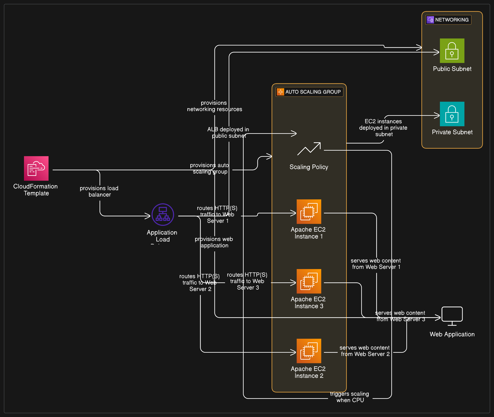

#  Auto Scaling Lab with Apache Web Servers (CloudFormation)

This CloudFormation template sets up a complete Auto Scaling infrastructure on AWS using Apache web servers behind an Application Load Balancer (ALB). It demonstrates dynamic scaling based on CPU usage with scale-up and scale-down policies.

---

## Features

- **Auto Scaling Group (ASG)** with a launch template for Apache web servers.
- **Application Load Balancer (ALB)** distributing HTTP traffic across instances.
- **Custom Apache Web Page** showing instance metadata and a stress button.
- **CloudWatch Alarms** to monitor CPU usage and trigger:
  - 🔺 Scale up when CPU > 50%
  - 🔻 Scale down when CPU ≤ 50%
- **Stress Button** on web page triggers CPU load via `stress` utility.
- Deployed into **custom VPC**, with public and private subnets.
- Fully configurable using parameters.

---

## Parameters

| Name              | Description                                      | Type                         |
|-------------------|--------------------------------------------------|------------------------------|
| `VpcId`           | VPC ID to deploy resources into                  | `AWS::EC2::VPC::Id`          |
| `PublicSubnetIds` | List of public subnet IDs for ALB                | `List<AWS::EC2::Subnet::Id>` |
| `PrivateSubnetIds`| List of private subnet IDs for ASG               | `List<AWS::EC2::Subnet::Id>` |
| `KeyName`         | EC2 Key Pair name for SSH access                 | `AWS::EC2::KeyPair::KeyName` |
| `Environment`     | Deployment environment name (e.g., Lab, Dev)     | `String`                     |

---

